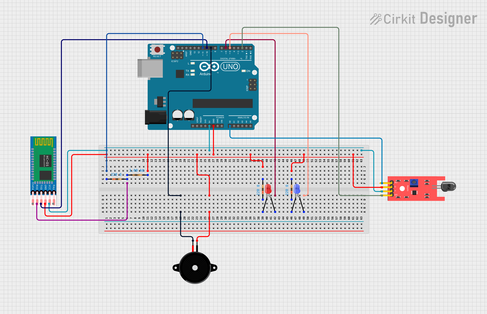

# PyroSafe-Monitor
A fire detection system designed to provide immediate alerts in the event of a fire. It uses a flame sensor to detect flames and activates a red blinking LED, a buzzer, and wireless notifications via Bluetooth.

Schematic Diagram:

A voltage divider was used across the RXD pin of the module to reduce the 5V output from the Arduino down to around 4.09V, protecting the module from possible damage associated with long-term use.