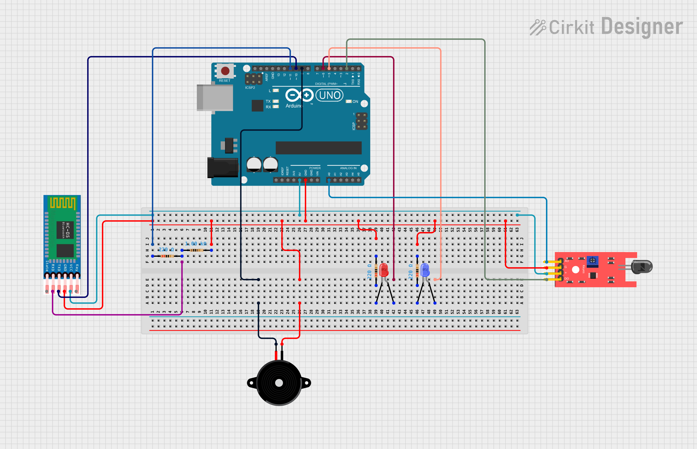

# PyroSafe-Monitor
A fire detection system designed to provide immediate alerts in the event of a fire. It uses a flame sensor to detect flames and activates a red blinking LED, a buzzer, and wireless notifications via Bluetooth.

## Features

- **Quick refresh rate and constant checking for fire/smoke**
- **Audio-visual alerts**
- **Wireless Bluetoothe notifications**

## Components Used

- Arduino Uno
- Flame Sensor Module
- HC-05 Bluetooth Module
- 10kΩ, 220Ω resistors
- 1 Piezo Buzzer
- LEDs (x2)
- Breadboard, Jumper wires

## How it works

- A flame sensor is setup and refreshes every 200ms
- A steady-state LED is on as long as no fire is detected
- Once fire detected the boolean state is updated
- 
## Schematic Diagram:

A voltage divider was used across the RXD pin of the module to reduce the 5V output from the Arduino down to around 4.09V, protecting the module from possible damage associated with long-term use.
